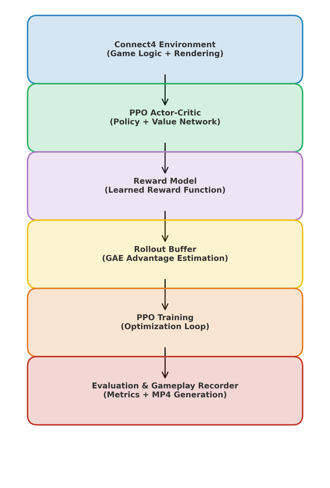

# Connect-4 Reinforcement Learning System Using Proximal Policy Optimization (PPO)

## 1. Overview

This repository contains a complete Reinforcement Learning (RL) system designed to train an intelligent agent to play the Connect-4 board game using the Proximal Policy Optimization (PPO) algorithm. The project includes a custom Connect-4 environment, a PPO-based Actor-Critic agent, a reward prediction model, a generalized advantage estimation (GAE) buffer, an automated evaluation module, and a high-quality gameplay recording system capable of producing narrated MP4 videos.

This README provides a comprehensive description of the system architecture, installation instructions, operational workflow, training pipeline, evaluation procedures, and usage guide.

---

## 2. Key Features

- Custom Connect-4 environment with full rule implementation.
- Mixed-strategy opponent (heuristic + random).
- PPO Actor-Critic neural architecture with convolutional feature encoder.
- Standalone reward model for reward prediction and training stability.
- Rollout buffer implementing Generalized Advantage Estimation (GAE).
- High-quality graphical renderer with matrix visualization.
- Automated gameplay recording with move overlays and narration.
- Full training, evaluation, and video-generation pipeline.
- Modular code design for easy extension and experimentation.

---

## 3. System Architecture

The system is composed of the following modules:

1. **Connect4Env**  
   A complete environment implementation including game mechanics, move legality, opponent policy, rendering, and terminal conditions.

2. **ActorCritic (PPO Agent)**  
   Convolutional encoder feeding separate actor and critic heads for policy and value estimation.

3. **RewardModel**  
   Predicts reward for state–action pairs to stabilize and shape learning.

4. **RolloutBuffer**  
   Stores trajectories and computes advantages using GAE.

5. **PPOTrainer**  
   Handles rollout generation, reward model training, PPO optimization, and gradient updates.

6. **Evaluation Module**  
   Runs multiple games to measure agent performance.

7. **Gameplay Recorder**  
   Produces narrated MP4 gameplay videos with board visualization, step information, and winner identification.

<h2>System Architecture</h2>

<p align="center">
  
</p>


---

## 4. Installation

### 4.1 Clone the repository
```bash
git clone <repository-url>
cd connect4-ppo
```
### 4.2 Install dependencies
pip install --upgrade pip
pip install gymnasium torch torchvision imageio moviepy pillow matplotlib tqdm

## 5.File Structure
├── connect4_ppo.py             
├── connect4_demo.mp4         
└── README.md               

This structure is intentionally minimalistic to ensure clarity and ease of reproducibility.

---

## 6. Connect-4 Environment

### 6.1 Board Representation

The Connect-4 board is implemented as a 6 × 7 matrix. Each entry corresponds to a cell containing:

- `1` : Agent-controlled disc  
- `-1`: Opponent-controlled disc  
- `0` : Empty cell  

This numerical representation simplifies the encoding of board states and facilitates convolutional processing.

### 6.2 Game Mechanics

The environment implements all core Connect-4 mechanics, including:

- Gravity-based disc placement (discs fill from bottom to top).
- Validation of legal and illegal moves.
- Automatic opponent moves executed immediately after the agent.
- Terminal condition detection:
  - Horizontal, vertical, and diagonal wins.
  - Draw upon full board occupancy.
  - Illegal action termination with penalty.

### 6.3 Opponent Strategies

Three distinct opponent modes are implemented:

1. **Random**  
   Selects uniformly from legal actions.

2. **Heuristic**  
   Evaluates immediate win possibilities and blocking conditions:
   - Attempts to win instantly.
   - Blocks the agent’s immediate winning moves.

3. **Mixed**  
   Randomly alternates between random and heuristic behavior for variability.

### 6.4 Rendering System

Each environment frame includes two synchronized visualizations:

1. **Graphical Board**  
   - Colored discs representing both players  
   - Highlighting of move positions  
   - Winner line detection  

2. **Matrix Board View**  
   - Numerical grid representation aiding debugging and analysis  

These views are merged horizontally to form a single combined frame used both during training debugging and gameplay video generation.

---

## 7. PPO Agent Architecture

### 7.1 Feature Extraction

A convolutional neural network (CNN) processes the board input (6 × 7 grid), enabling spatial recognition of:

- Four-in-a-row patterns  
- Threat lines  
- Blocking opportunities  
- Board symmetry independent features  

### 7.2 Actor Network

The actor head outputs a probability distribution over all 7 possible actions, representing column selections. Actions may be sampled stochastically for exploration or selected greedily during evaluation.

### 7.3 Critic Network

The critic head estimates the scalar value of a board state, enabling computation of temporal-difference targets and advantages.

### 7.4 PPO Optimization

The PPO implementation includes:

- Clipped probability ratio objective  
- Value function regression  
- Entropy regularization  
- Randomized mini-batch gradient descent  
- Gradient clipping for numerical stability  

All hyperparameters are configurable from within the PPOTrainer module.

---

## 8. Reward Model

The reward model is a secondary neural network trained in parallel with the PPO agent. Its responsibilities include:

- Encoding board states with convolutional layers  
- Concatenating action-one-hot vectors  
- Predicting scalar rewards associated with transitions  

This approach provides smoother learning dynamics by supplying intermediate reward estimates, improving credit assignment across long episodes.

---

## 9. Training Pipeline

The training process is organized into a cyclical pipeline:

1. **Rollout Collection (2048 steps)**  
   The agent interacts with the environment to generate transitions containing:
   - Observations  
   - Actions  
   - Log probabilities  
   - Rewards  
   - Done flags  
   - Value estimates  

2. **Reward Model Training**  
   The model is trained on sampled transitions using supervised regression.

3. **PPO Update**  
The agent parameters are updated using clipped policy gradients and value losses.

4. **Buffer Clearing and Repetition**  
Ensures clean rollout segments for subsequent iterations.

Training continues until the total steps reach the defined threshold (default: 200,000).

The trained reward model is saved as:reward_model_final.pth

---

## 10. Evaluation Procedure

The evaluation module runs multiple episodes using either stochastic sampling or greedy policies. It reports:

- Wins  
- Losses  
- Draws  
- Illegal actions  

This allows for comprehensive benchmarking and comparison across training iterations.

Example output:
wins: 12
losses: 5
draws: 3


---

## 11. Gameplay Recording

The gameplay recording system generates a complete, narrated MP4 video illustrating the agent’s decision-making process.

### 11.1 Video Contents

Each frame includes:

- Combined graphical + matrix board  
- Episode number  
- Step number  
- Agent move annotation  
- Opponent move annotation  
- Illegal move warnings  
- Winner declaration  

### 11.2 Output File

The resulting video is saved as:connect4_demo.mp4


This video is ideal for presentations, demonstrations, and academic reviews.

---


## 12. User Manual

This section describes how to operate, train, evaluate, and record gameplay using the Connect-4 PPO system implemented in this project. All information corresponds exactly to the functionality inside the provided Connect4Env, ActorCritic, RewardModel, RolloutBuffer, PPOTrainer, evaluate(), and record_play() implementations.

### 12.1 Running the Complete Pipeline

The entire training–evaluation–recording process is executed with a single command:

python connect4_ppo.py

Execution automatically performs the following steps:

1. Initializes the custom Connect-4 environment (Connect4Env) with:
   - Mixed opponent strategy (random + heuristic)
   - Graphical + matrix rendering enabled
   - Reward shaping enabled

2. Initializes:
   - PPO Actor-Critic model (ActorCritic)
   - Reward prediction model (RewardModel)
   - PPOTrainer for optimization

3. Trains the PPO agent for approximately 200,000 timesteps using:
   - Rollouts of 2048 environment steps
   - PPO clipped objective
   - Generalized Advantage Estimation (GAE)
   - Entropy regularization
   - Value loss and policy loss balancing
   - Gradient clipping for stability

4. Trains the Reward Model on rollout experiences for improved reward prediction.

5. Saves the final Reward Model as:
   reward_model_final.pth

6. Evaluates the trained agent using the provided evaluate() function.

7. Records full gameplay episodes using the record_play() system, producing:
   connect4_demo.mp4

All components run sequentially without requiring user intervention.

### 12.2 Output Files Generated

After the pipeline finishes, the following output files are produced:

1. reward_model_final.pth
   This file contains the learned parameters of the Reward Model.

2. connect4_demo.mp4
   A complete gameplay demonstration video including graphical and matrix rendering and move-by-move overlays.

3. Console Logs
   The script prints PPO updates, reward model loss, evaluation results, and recording completion messages.

### 12.3 Modifying Environment Settings

Environment configuration options:

env = Connect4Env(
    opponent="mixed",
    reward_shaping=True,
    render_cell_size=64
)

### 12.4 Modifying PPO Hyperparameters

Key hyperparameters are defined inside:

update(self, gamma=0.99, lam=0.95, clip=0.2)

### 12.5 Video Recording

Recording is controlled using:

record_play(model, env, episodes=12, eps=0.25)

It produces annotated graphical+matrix frames and compiles them into MP4 output.

### 12.6 Extending the Project

Extensions include new opponents, human input mode, additional rendering, saving actor/critic weights, and logging training curves.

---

## 13. Results Summary

The PPO agent demonstrates:
- Increased win rates against random opponents
- Block capability against heuristic opponents
- Reduced illegal moves
- Learned center-column preference
- Improved reward optimization due to PPO+GAE

---


